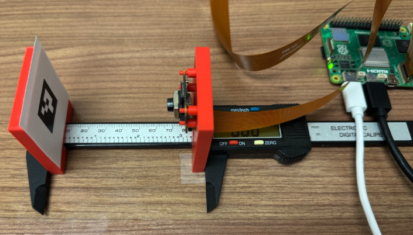
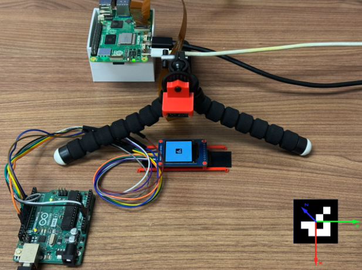

# Position Estimation Using Markers and Raspberry Pi Camera
This repository contains modules to compute position of a marker or multiple markers using a camera and Raspberry Pi.
It includes utilities to capture images, calibrate cameras, and summarize collected data. The position estimation 
module supports variety of fiducial marker libraries, including ArUco, AprilTag, STag, abd custom 4-point marker 
(4 bright markers arranged in 3d with a dark background).

Raspberry Pi Camera Module 3, ArdCcam Mini 16MP IMX519, CrazyFlie AiDeck Camera are supported. 

Position estimations are computed in realtime and can be broadcast over UDP socket.

Some modules of this software are partially base on this repository [1].

# Requirements
- Raspberry Pi (tested on Raspberry Pi 5) with Raspberry Pi OS (bookworm) installed
- Raspberry Pi Camera Module 3 (Wide or Regular)
- Caliper or ruler for measurements

# Experiment Setup
We used the following setup to conduct experiments using a printed ArUco marker and an LCD display.





# Installation and Setup
Connect the camera to the Raspberry Pi and turn it on.
Ensure the camera is detected and works using the following commands.

```commandline
rpicam-hello --list-cameras
rpicam-hello
```

Clone and install requirements:

```commandline
git clone https://github.com/flyinglightspeck/aruco-pose-estimation.git
cd aruco-pose-estimation
bash setup.sh
```

# Active Virtual Environment Before Running
```commandline
source .env/bin/activate
```

# Marker Detection
Run the following command to start the program. It will run for 10 seconds and detect AruCo marker in each frame in 
realtime. Follow the example to view or save the results:

Preview camera images:
```commandline
python pi_pose_estimation.py -i pi3 -r 720p -t 10 --marker_size 0.02 --live
```

Save the results:
```commandline
python pi_pose_estimation.py -i pi3 -r 720p -t 10 --marker_size 0.02 --save -e 200mm
```

Note: if you want to process the collected data using this software pass the distance you are measuring, in 
millimeters, similar to the above command (-e [DIST]mm). This will enable the software to compute the error.

Modify other arguments based on the help as needed:

```commandline
usage: pi_pose_estimation.py [-h] -i CAMERA [-s MARKER_SIZE] [-k K_MATRIX] [-d D_COEFF] [-m MARKER] [-c DICT] [-t DURATION] [-n SAMPLE] [-w WIDTH] [-y HEIGHT] [-v] [-r RES] [-g] [-o] [-sm] [-b] [-mr] [-e NOTE] [-l LENSPOS]

options:
  -h, --help            show this help message and exit
  -i CAMERA, --camera CAMERA
                        One of arducam, aideck, pi3, pi3w, or pihq6mm
  -s MARKER_SIZE, --marker_size MARKER_SIZE
                        Dimension of marker (meter)
  -k K_MATRIX, --K_Matrix K_MATRIX
                        Path to calibration matrix (numpy file)
  -d D_COEFF, --D_Coeff D_COEFF
                        Path to distortion coefficients (numpy file)
  -m MARKER, --marker MARKER
                        Type of tag to detect. One of ARUCO, APRILTAG, STAG, or P4
  -c DICT, --dict DICT  Type of dictionary of tag to detect
  -t DURATION, --duration DURATION
                        Duration of sampling (second)
  -n SAMPLE, --sample SAMPLE
                        Number of samples per second
  -w WIDTH, --width WIDTH
                        Width of image
  -y HEIGHT, --height HEIGHT
                        Height of image
  -v, --live            Show live camera image
  -r RES, --res RES     Image resolution, one of 244p, 480p, 720p, 1080p, or 1440p, overwrites width and height
  -g, --debug           Print logs
  -o, --save            Save data
  -sm, --sensor_modes   Print sensor modes of the camera and terminate
  -b, --broadcast       Broadcast measurements modify worker socket with proper ip and port
  -mr, --max_fps        Use maximum fps
  -e NOTE, --note NOTE  Notes
  -l LENSPOS, --lenspos LENSPOS
                        Lens position for manual focus
```


# Process Results
Run the following command to process the results. It will generate a table of the experiments sorted based on the 
measured distance. 

```commandline
python process.py
```

By default, it reads the results form the `results` directory. You can change it by passing the `-i` argument.


# Calibration
We have already calibrated a total of 9 configurations using 3 cameras and 3 resolutions:

Cameras:
- pi3: Raspberry Pi Camera
- pi3w: Raspberry Pi Camera Wide
- hqpi6mm: Raspberry Pi Camera HQ with [6mm Wide Angle Lens](https://www.pishop.us/product/6mm-wide-angle-lens-for-raspberry-pi-hq-camera-cs/) 

Resolutions:
- 480p (640x480px)
- 720p (1280x720px)
- 1080p (1920x1080px)

After experimenting with different configurations and considering aspects like minimum and maximum size of the 
marker, minimum and maximum distance between camera and marker, frame rate, and marker detection rate we decided to 
use pi3 and pi3w cameras at 720p resolution for our experiments.

If you need to recalibrate your cameras, follow these steps. Make sure it's displayed at a 1:1 scale otherwise 
adjust the input parameters of the calibration program. The default is a 9x6 checkerboard with 0.0254m (1inch) squares.
Take 10 to 15 images of the checkerboard pattern from different angles and distances using the following command:

```commandline
python get_images.py -i CAMERA -r RES
```

Press `s` to take images and `esc` to quit. The images will be saved in the `calibration/CAMERA/RES` directory.

After takeing images, run the following to compute calibration matrix and distortion coefficients. They will be 
saved in the same directory.

```commandline
python calibration.py -i CAMERA -r RES
```

Note: set width, height, and square_size if you are using a different checkerboard.

# Swarical Paper (MM'24)
The results from experiments conducted using this software were used in the implementation of Swarical software and 
reported in the Swarical paper [2]. The code to generate the plots used in the Figures 6-9 of the paper are in the 
`cameraplots.nb` Mathematica notebook.

# References
[1] https://github.com/GSNCodes/ArUCo-Markers-Pose-Estimation-Generation-Python
[2] Hamed Alimohammadzadeh, and Shahram Ghandeharizadeh. 2024. Swarical: An Integrated Hierarchical Approach to 
Localizing Flying Light Specks. In Proceedings of the 32nd ACM International Conference on Multimedia (MM '24). Association for Computing Machinery, New York, NY, USA. https://doi.org/10.1145/3664647.3681080